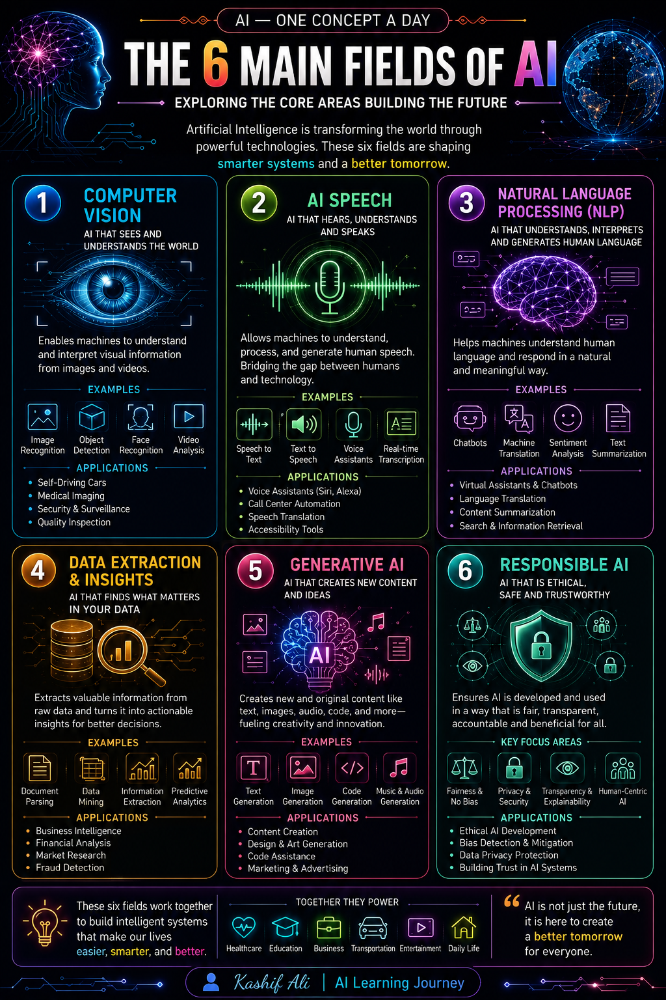

# 🤖 AI — One Concept a Day

> 🌱 **My AI Learning Journey — Learning, Understanding & Sharing AI One Concept at a Time.**

Welcome to my personal collection of AI learning notes and infographics.

Every day, I choose an AI concept, learn it deeply, understand it in simple terms, and turn it into a clean visual infographic.

My goal is not only to learn AI, but also to share useful knowledge with others.

---

## 🎯 Purpose

- 📚 Learn AI concepts step by step
- 🧠 Understand complex ideas in simple language
- 🎨 Turn learning into visual infographics
- 📖 Build a personal AI knowledge library
- 🤝 Share useful AI knowledge with others
- 🚀 Track my journey toward becoming an **AI Automation Engineer**

---

## 📖 Table of Contents

| Day | Concept |
|-----|---------|
| 01 | What is Artificial Intelligence? |
| 02 | The 6 Main Fields of AI |

> 🔄 This table will grow as new concepts are added.

---

## 🖼️ Infographics Gallery

### Day 01 — What is Artificial Intelligence?

**Key idea:**  
Artificial Intelligence is the field of creating systems that can perform tasks that normally require human intelligence.

---

### Day 02 — The 6 Main Fields of AI

**Key idea:**  
AI includes several important fields such as Computer Vision, AI Speech, Natural Language Processing, Data Extraction & Insights, Generative AI, and Responsible AI.

---

## 🛠️ How I Create These

1. 📌 Choose one AI concept
2. 📚 Study and understand the concept
3. 🔍 Research and verify the information
4. ✍️ Convert the concept into simple notes
5. 🎨 Create a clear and engaging infographic
6. 📤 Add it to this repository
7. 🔄 Update the learning progress

---

## 🌱 Progress

- ✅ Concepts covered so far: **2**
- 🎯 Goal: Keep learning and adding one concept at a time
- 📚 Purpose: Build a strong foundation in AI

> **One concept may look small, but many concepts build strong knowledge.**

---

## 🤝 Connect

Feel free to explore, learn along, or suggest an AI concept you'd like to see explained.

**Author:** Kashif Ali  
**GitHub:** [@Kashif-Ali-byte](https://github.com/Kashif-Ali-byte)

---

## ⭐ Support the Journey

If these learning resources are useful to you, consider giving the repository a ⭐ **Star**.

Your support is appreciated and motivates me to keep learning and sharing.

---

### 🌟 Learning • Understanding • Sharing

**Kashif Ali | AI Learning Journey**
